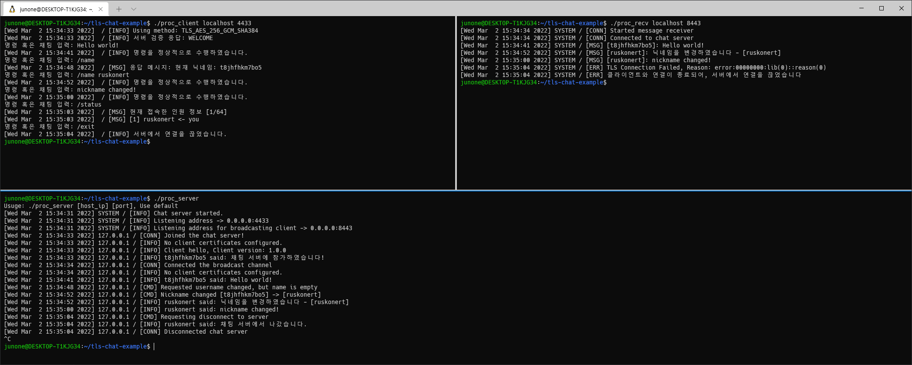

# 채팅 프로그램
[](https://app.travis-ci.com/Ruskonert/tls-chat-project)<br />
이 프로젝트에서는 C언어를 복습하고, 활용 능력을 향상시키기 위한 목적으로 수행하였으며, OpenSSL 및 비동기 소켓 기반의 채팅 서버, 클라이언트를 개발합니다.<br /><br />
최종 업데이트 날짜 2022.03.02<br /><br />

# 주요 기능
- 비동기 소켓 기반으로 설계되어 여러 명이 대화할 수 있으며, 한 서버에 최대 64명까지 접속 가능합니다.
- 기본 채팅 기능을 지원합니다.
- 특별한 기능을 사용하기 위한 명령어를 지원합니다. (지원 기능: 닉네임 변경, 1:1 메시지 기능, 현재 인원 출력, 연결 끊기)

# 통신 설명
이 프로그램은 TLSv1.3 기반으로 통신하며, 총 64명의 클라이언트 유저가 동시에 연결할 수 있습니다.
핸드쉐이크는 3-way-handshake 및 TLS 절차를 거친 후, 아래와 같은 절차를 거칩니다.</br>
이 떄, "Packing Message"이라고 하는 것은 클라이언트 혹은 서버가 하고자 하는 명령, 채팅 데이터를 전송하기 위한 규격입니다.
즉, 서버와 클라이언트가 통신을 수행할 때는 모두 "Packing Message" 규격으로 전송합니다.</br></br>

```
 Client                                             Server
   |                                                   |
   |                  (1) 핸드쉐이크                    |
   |                                                   |
   |                  ["CLIENT_HELLO"]                 |
   |-------------------------------------------------->|
   |                  ["WELCOME|FAIL"]                 |
   |<--------------------------------------------------|
   |                                                   |
   |               (2-1) 통신 프로세스 1                |
   |                                                   |
   |               [SEND PACKING MESSAGE]              |
   |-------------------------------------------------->|
   |               ["OK|FAIL|NOSUPPORT"]               |
   |                        or                         |
   |               [ACK PACKING MESSAGE]               |
   |<--------------------------------------------------|
   |                                                   |
   |                                                   |
   |               (2-2) 통신 프로세스 2                |
   |                                                   |
   |           [SEND SERVER PACKING MESSAGE]           |
   |<--------------------------------------------------|
   |               ["OK|FAIL|NOSUPPORT"]               |
   |-------------------------------------------------->|
   |                       ...                         |
   |                                                   |
   |                                                   |
   |                  (3) 연결 끊기                     |
   |                                                   |
   |           ["SERVER_BYE"|"CLIENT_BYE"]             |  
   |<------------------------------------------------->|
   |                     ["BYE"]                       |  
   |<------------------------------------------------->|
```
</br>
핸드쉐이크는 클라이언트가 <code>"CLIENT_HELLO"</code>를 전송하면, 서버는 <code>"WELCOME"</code>으로 응답하여 수락합니다.
이 때, 서버에서 접속 인원이 꽉차거나, 기타 사유로 연결이 불가한 경우 <code>"FAIL"</code>로 응답하여 연결을 끊을 수 있습니다.</br></br>

과정 (1) 이후에는 통신 프로세스가 크게 2가지 방식이 있습니다. </br>
과정 (2-1)은 클라이언트가 서버에 메세지를 보내는 경우로, 채팅 메시지를 전송하거나 원하고자 하는 명령를 수행하기 위해 보내는 경우입니다.</br>
"Packing Message"를 전송하면, 서버는 4가지 형식 중 하나로 응답합니다.

- <code>OK</code>: 정상 처리되었을 경우 응답합니다.
- <code>FAIL</code>: 메시지 형식이 잘못되었거나, 서버에서 정상적으로 처리하지 못했을 때 응답합니다.
- <code>NOSUPPORT</code>: 서버에서 명령어를 지원하지 않을 때 응답합니다.
- <code>ACK PACKING MESSAGE</code>: 클라이언트에서 요청한 명령어에 대한 응답을 Packing Message 규격으로 응답합니다.

과정 (2-2)는 서버가 클라이언트에게 메세지를 보내는 경우로, 다른 유저가 전송한 채팅 메시지를 전달해주거나 명령를 내리기 위해 보내는 경우입니다.
"Packing Message"를 전송하면, 마찬가지로 클라이언트에서 3가지 형식(<code>OK, FAIL, NOSUPPORT</code>) 중 하나로 서버에 응답합니다. </br>
과정 (2-1), (2-2)는 비동기 방식으로 동작하여 개별적으로 수행됩니다.
</br></br>
과정 (3)은 서버 혹은 클라이언트에서 연결을 끊기 위해 보내는 경우로, 서버 상태 혹은 클라이언트 연결 상태에 따라서 연결을 끊기 위한 요청을 보낼 수 있습니다. 이에 대한 응답을 <code>"BYE"</code>로 응답합니다.


# Packing Message의 상세 필드 설명
"Packing Message"의 길이는 총 16,384바이트의 길이를 가지며, 4바이트는 매직 넘버(Magic Number), 2바이트는 명령어 유형, 2바이트는 메시지의 길이로,
메시지의 길이는 실제 데이터의 길이를 의미합니다. 이 때, 실제 데이터에는 채팅 메시지 혹은 명령을 수행하기 위해 필요한 데이터가 있으며, 길이값은 0바이트부터 최대 16,376바이트까지 가질 수 있습니다.
```
----------------------------------------------------------------------
| Magic Number (4 bytes) | Command type (2 bytes) | Length (2 bytes) |
----------------------------------------------------------------------
|                     Message (0 ~ 16,376 bytes)                     |
----------------------------------------------------------------------
```
</br>
- 매직 넘버(Magic Number) 필드는 프로토콜을 식별하기 위한 숫자 데이터를 담고 있으며, 항상 <code>"\x99\x88\x77\x66"</code>를 갖습니다.
- 명령어 유형(Command type)은 클라이언트 혹은 서버가 실행하고자 하는 명령의 유형입니다.
- 길이는 메시지(Message) 필드에 대한 실제 길이입니다. 필드값에는 최대 <code>"\xFF\xFF"(=65,535)</code>까지 가질 수 있지만, 실제 허용 가능 범위는 0부터 <code>"\x3F\xF8"(=16,376)</code>입니다.
- 메시지(Message) 필드는 채팅 메세지 혹은 명령을 수행하기 위한 필요한 데이터를 포함합니다.
</br></br>

▼명령어 유형에 대한 상세 정보는 다음과 같습니다 ▼
</br>

|Command <br>Type|클라이언트</br>사용 유무 | 서버</br>사용 유무 | 목적 | 명령어 사용법 <인자> |
|:---:|:---:|:---:|:------:|:---:|
|<code>0x00</code>|O|X|초기 핸드쉐이크 수행 시 사용 | 없음 (내부 처리)
|<code>0x01</code>|O|O|채팅 메시지 전송시 사용 | <보낼 내용>
|<code>0x02</code>|O|X|닉네임 변경시 사용 | /name <바꿀 이름>
|<code>0x03</code>|O|X|1:1 메시지 전송시 사용 | /send <보낼 유저 IP> <보낼 내용>
|<code>0x04</code>|O|X|현재 접속 인원 확인시 사용 | /status
|<code>0x05</code>|O|O|연결 헤제시 사용 | /exit

# 소스 트리 설명
프로젝트의 소스 트리는 다음과 같습니다.

## 공용 파일
| 파일명 | 헤더 파일 포함 여부 | 설명 |
|:---:|:---:|:------------:|
| <code>type.h</code> | O (자체 헤더) | 채팅 프로그램을 구현하는 데 있어 사용하는 기본 타입, 전역 구조체를 정의합니다. |
| <code>comm.c</code> | O | Packing Message를 생성하고, 변환하고, 송신하는 기능을 구현합니다. |
| <code>connection.c</code> | O | 클라이언트, 서버에 대한 네트워크 연결 정보를 생성하는 기능, 구조체를 정의합니다. |
| <code>util.c</code> | O | 소스 코드가 동작하는 데 유용한 보조적 기능을 구현합니다. |
| <code>cmd.h</code> | O (자체 헤더) | 커맨드 유형을 정의합니다. |

## 서버 파일
| 파일명 | 헤더 파일 포함 여부 | 설명 |
|:---:|:---:|:------------:|
| <code>server/server_main.c</code> | O | 서버 프로그램의 <code>main</code> 함수를 구현합니다. |
| <code>server/server_net.c</code> | O | TLS 핸드쉐이크 과정을 구현하고, 클라이언트 연결 정보를 관리하기 위한 기능, 구조체를 정의합니다. |
| <code>server/server_comm.c</code> | X | 클라이언트와 서버 프로그램 간 패킷을 읽어들이고, 메시지로 변환 및 처리하는 기능을 구현합니다. |
| <code>server/server_cmd.c</code> | X | 클라이언트에서 요청한 명렁을 처리하는 기능을 구현합니다. |
| <code>server/server_broad.c</code> | O | 클라이언트의 메시지 리시버를 대상으로 연결을 수행하는 기능을 구현합니다. |

## 클라이언트 파일
| 파일명 | 헤더 파일 포함 여부 | 설명 |
|:---:|:---:|:------------:|
| <code>client/client_main.c</code> | X | 클라이언트 프로그램의 <code>main</code> 함수를 구현합니다. |
| <code>client/client_comm.c</code> | O | 서버 프로그램에 명령을 보내기 위한 메시지로 변환 및 처리하는 기능을 구현합니다. |
| <code>client/client_broad.c</code> | X | 클라이언트의 메시지 리시버 기능을 구현합니다. |
| <code>client/client_net.c</code> | O | TLS 핸드쉐이크 과정을 구현하고, 서버와의 연결을 수행하기 위한 기능을 정의합니다. |

## 부속 파일
| 파일명 | 설명 |
|:---:|:------------:|
| <code>cert/server.crt<br /> cert/server.csr<br /> cert/server.key</code> | TLS 프로토콜 사용을 위해 필요한 개인 키, 인증서 파일입니다. |
| <code>Makefile</code> | 프로젝트 컴파일을 위한 make 파일입니다. |

# 설치 및 컴파일
```shell
# complie and install openssl
git clone https://github.com/openssl/openssl.git
cd openssl
./Configure --prefix=/usr/local
make
make install

# linking 64 bit-based library file
ldconfig /usr/local/lib64 (required sudo mode)

# install libssl-dev
sudo apt-get install libssl-dev

# cd ~/tls-chat-example
make
```

# 사용 방법
```shell
# 서버를 실행합니다. 포트 값을 입력하지 않으면 기본 포트는 4433입니다.
# 메세지 리시버는 8443번 포트를 사용합니다.
sudo ./proc_server <port>

# 클라이언트를 실행합니다. 포트 값을 입력하지 않으면 기본 포트는 4433입니다.
# proc_recv는 메시지를 받기 위한 메시지 리시버(수신 프로그램)입니다.
./proc_recv <host_ip> <port>
./proc_client <host_ip> <port>
```

# 이슈 사항 정리
[이슈 사항 보기](/issues.md)

# 개발 환경
- Ubuntu 18.04 64-bit
- GCC (C11)
- OpenSSL 3.1.0-dev
- libssl-dev:amd4 1.1.1-1ubuntu2.1~18.04.7