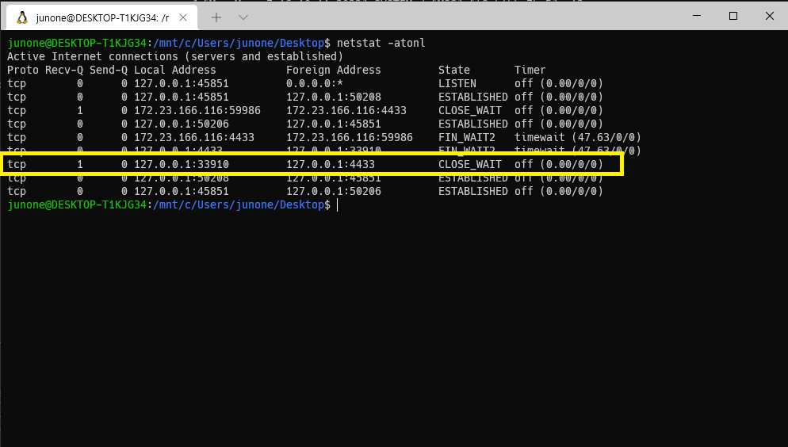
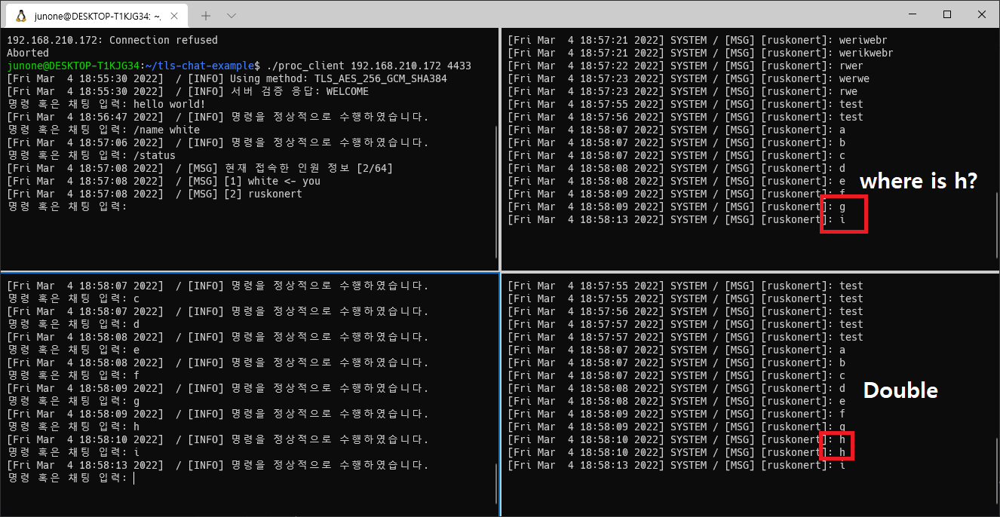

# 발견된 주요 이슈
이 문서는 프로젝트를 진행하면서 발견된 주요 문제들을 기술합니다. 해결된 사항은 ✅, 여전히 해결이 필요한 사항은 ❌을 기재합니다.  

## 클라이언트 재연결에 관한 문제 ✅
(증상) 클라이언트가 연결을 종료한 후, 다시 연결하려고 하면 연결이 안되는 현상이 발생함.<br />
(원인) close() 함수가 클라이언트에서 호출이 안되어, 서버에서 CLOSE_WAIT로 무한히 대기중이라서 연결이 안됨. <br />


(해결방안) 클라이언트 측 프로그램의 close() 함수 호출을 통해 클라이언트가 연결을 닫아서 해결함.<br />
<br />

## 현재 인원 출력에 관한 문제 ✅ 
(증상) 인원 정보가 8명까지만 출력되는 문제점이 발생함. <br />
(원인) Packing Message를 생성하는 루틴이 문제가 있었음. 메시지 길이를 최대 255까지만 설정되어 긴 메세지가 잘리는 현상이 존재하였음. 즉, 포맷 스트링을 잘못 기재함.<br />
```c
char* packing_message_to_string(int type, int len, char* message)
{
    char *pkt = (char*)malloc(sizeof(char) * MAX_LENGTH_MESSAGE);
    sprintf(pkt, "%s%04hhx%04hhx", MAGIC_NUMBER, type, len); // error!
    strcat(pkt + 12, message);
    return pkt;
}
```
(해결방안) 포맷 스트링을 수정해 해결함 <br />
```c
char* packing_message_to_string(int type, int len, char* message)
{
    char *pkt = (char*)malloc(sizeof(char) * MAX_LENGTH_MESSAGE);
    sprintf(pkt, "%s%04hx%04hx", MAGIC_NUMBER, type, len);
    strcat(pkt + 12, message);
    return pkt;
}
```
<br />

## 브로드캐스트에 대한 램 누수 문제 ❌
(증상) 메시지를 다른 유저에게 브로드캐스트한 후, 메시지에 대한 램 할당이 해지되지 않고 사용량이 계속 늘어남.<br />
(원인) <code>server_cmd.c</code> 파일에서 <code>cmd_broadcast_message</code>함수에서 쓰레드를 생성하고, broad_send_message 함수 내에서 메모리 누수가 발생함, 쓰레드 작업이 끝났음에도 불구하고 자원 할당이 해제되지 않는 현상이 있었음.<br />
(해결방안) 쓰레드 함수 어딘가에서 자원 할당이 필요한 부분이 존재하며, 자원을 헤제해주는 루틴이 필요함. <br />
<br />

## 클라이언트 및 메시지 수신기가 연결된 후, 메시지 수신기가 강제 종료 시 프로그램이 정지하는 문제 ✅
(증상) 서버로부터 메시지가 오면, <code>send_broad_message</code> 함수에서 SSL_read 함수 호출시 "Broken pipe" 오류가 발생하면서 프로그램이 정지됨. <br />
(원인) 메시지 수신기가 일방적으로 수신만 하기 때문에 문제가 발생함. <br />
(해결방안) 본래 메시지만 받기 위해 메시지 수신기를 하나의 서버 형태로 개발해 포트 개방과 같은 추가적인 문제도 존재하였음. 이에 클라이언트 형태로 코드를 전환하였으며, <code>client_broad.c</code> 및 <code>server_broad.c</code> 파일을 수정함<br />
또한, 클라이언트의 동작 오류로 인해 발생 가능한 Broken pipe 시그널에 대해 signal handler을 활용해 핸들링하여 서버 프로그램이 종료되지 않도록 코드를 수정하였음<br />
```c
// in server_broad.c
void* communicate_broad_user(void* argv)
{
    ...
    signal(SIGPIPE, SIG_IGN); // <-- 시그널에 대한 핸들러 추가
    ...
}
```

<br />

## 클라이언트 Stack smashing 문제 ✅
(증상) 클라이언트가 연결을 끊는 명령어를 수행한 뒤, Stack smashing exception 문제가 발생함. <br />

```log
[Fri Feb 25 15:24:44 2022]  / [INFO] Using method: TLS_AES_256_GCM_SHA384
[Fri Feb 25 15:24:44 2022]  / [INFO] 서버 검증 응답: WELCOME
명령 혹은 채팅 입력: hello world!
[Fri Feb 25 15:24:47 2022]  / [INFO] 명령을 정상적으로 수행하였습니다.
명령 혹은 채팅 입력: /exit
[Fri Feb 25 15:24:48 2022]  / [INFO] 서버에서 연결을 끊었습니다.
*** stack smashing detected ***: terminated
```
(원인) <code>client_net.c</code> 파일에서 <code>execute_client_manager</code> 함수 내 memset를 잘못 사용해 스택 내 main 함수 주소에 대한 EBP 값을 날려버림 <br />
(해결방안) client_net.c</code> 파일에서, 코드를 다음과 같이 수정함. <br />

```c
        if(err < 0)
        {
            output_message(MSG_ERROR, conn, message_mutex, "Failed to send the handshake message!\n");
            return -1;
        }

        memset(buf, 0, MAX_LENGTH_MESSAGE); // before
        memset(buf, 0, MAX_LENGTH_STR_MESSAGE); // after
```

## 메시지 전송이 안되는 문제 ✅
(증상) 현재 접속한 유저에 브로드캐스트 메시지를 전송할 떄, 일정 확률로 메시지가 전송되지 않거나, 한 유저에게만 메시지가 2개 이상 전송되는 문제가 발생함. <br />


(원인) <code>broad_send_message</code>에 대한 쓰레드 함수를 호출하기 전, 유저 컨텍스트 데이터와 메시지 데이터를 넘겨 주는데, 넘겨 주는 방식을 지역 변수 값에 담아 넘겨주는 방식을 사용했음. 이로 인해 쓰레드 간 safety가 보장되지 못해 쓰레드에 넘겨준 지역 변수 값이 안정적으로 assign될 수 없음
```c
        pthread_t thread;
        void* a_list[] = {o_user, s_message}; // problem!!

        pthread_create(&thread, NULL, broad_send_message, (void*)a_list);
```

(해결방안) 쓰레드에 인자를 안전하게 전달하기 위해, 인자 전달을 위한 구조체를 구현하였으며, <code>server_cmd.c</code> 내 <code>cmd_broadcast_message</code> 함수에서 코드를 다음과 같이 수정함<br />
```c
        struct broad_arg_t* a_list = (struct broad_arg_t*)malloc(sizeof(struct broad_arg_t));

        a_list->user = o_user;
        a_list->message = s_message;

        pthread_create(&thread, NULL, broad_send_message, (void*)a_list);
```

상세 사항은 해당 URL를 참고: https://github.com/Ruskonert/tls-chat-project/commit/d2d131657575a4b19abb7776012ed790cd25a787<br />